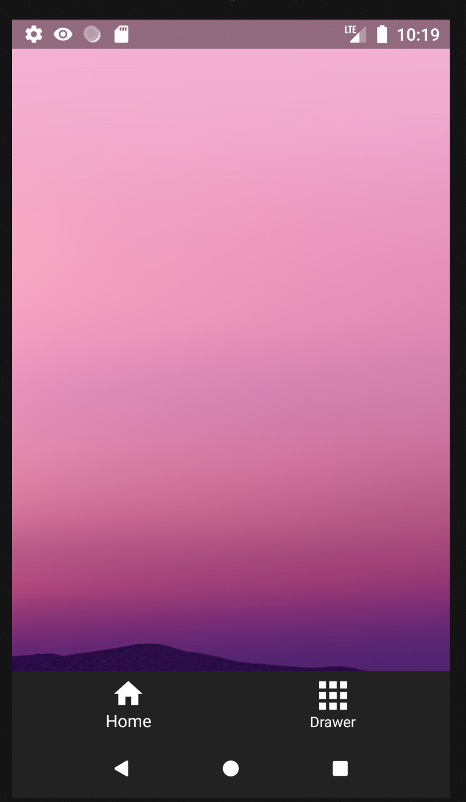
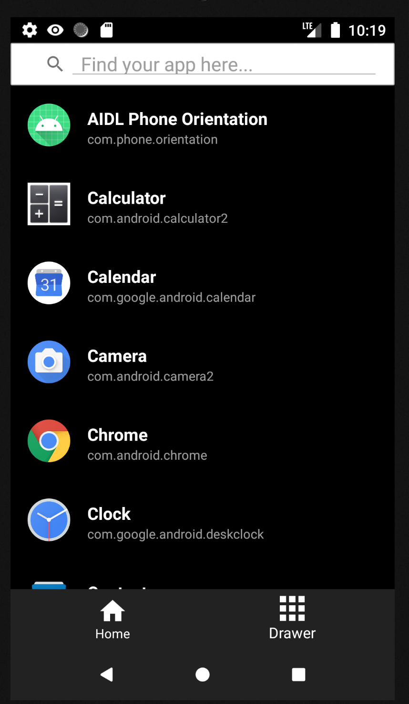
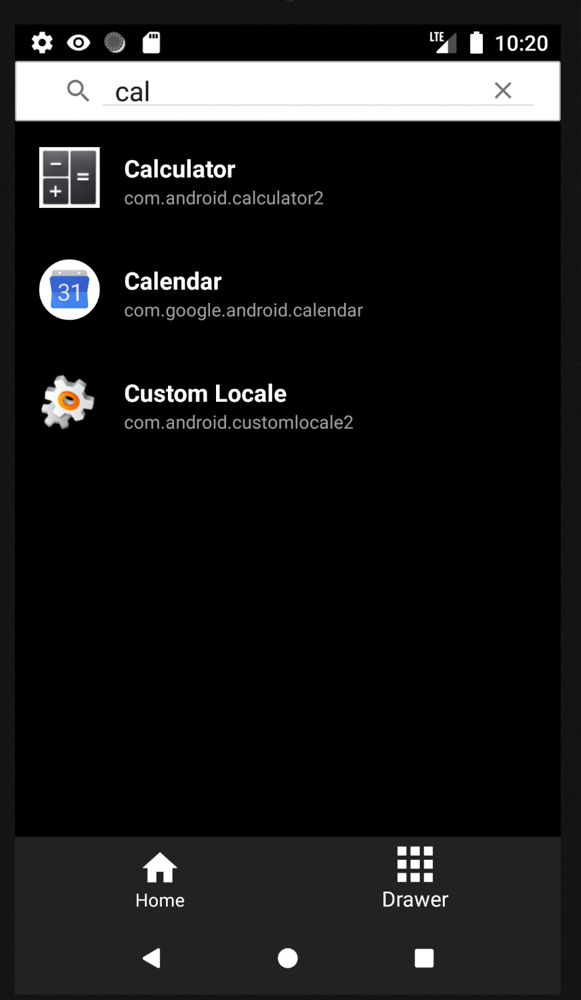

# APP Home Launcher

## App Description:
This application will show all the launcher apps list which are currently installed in the phone. 

## App Main Feature:
UI implementation for listing and launching applications
* List of application data in a recycler view that containing following information - App name, Package name, Icon, Main Activity class name .
* Launch the application when clicked on the app icon/list item. 
* Add a search bar on top which will filter the application list based on the name.

## App Snapshot:

